# Checkin Pod 系統架構

文件版本：2026-08-08

對應程式版本：Security Review remediation working tree
狀態：現況文件

## 1. 系統目的

Checkin Pod 為活動主辦單位提供 CSV 名單匯入、QR Code 報到、多入口協作、即時投影、活動歷史與結果匯出。系統提供兩種操作模式：

- 單機模式使用一台主要工作站，每筆報到立即寫入 D1。
- 多機模式使用多個入口工作站，每筆報到立即寫入同一場活動的 D1 資料。

D1 是兩種模式的操作資料來源。IndexedDB 保存目前活動快取、完整原始欄位與顯示設定。

## 2. 系統脈絡

[Mermaid 原始檔](diagrams/architecture_01_flowchart_system_context.mmd)

### Actors

| Actor | 工作 | 資料權限 |
|---|---|---|
| 活動管理員 | 匯入、設定、手動報到、工作站管理、活動歷史、刪除 | 有效 admin session 範圍內的完整活動資料 |
| 報到工作站 | 掃描 QR Code、顯示選定欄位 | lane Cookie 對應活動與工作站的最小資料 |
| 來賓 | 提供 QR Code、查看掃描結果 | 當次掃描結果 |
| 投影觀眾 | 查看活動名稱與報到進度 | 公開且經隱私設定轉換的 projection payload |
| 維運者 | 部署 Worker、D1、bindings 與 secrets | 基礎設施與環境設定 |

## 3. Runtime 元件

| 元件 | 路徑 | 職責 |
|---|---|---|
| 管理中控台 | `app/page.tsx` | CSV 匯入、模式選擇、報到、隱私設定、歷史與匯出 |
| 報到畫面 | `app/scan/page.tsx` | USB 鍵盤輸入、相機掃描、工作站啟用、即時報到與結果呈現 |
| 投影畫面 | `app/projection/page.tsx` | 讀取公開 projection feed、繪製星球與 cue |
| Benchmark | `app/benchmark/` | 顯示已驗證壓力測試數字 |
| 瀏覽器資料核心 | `app/checkin-core.ts` | CSV parsing、IndexedDB 活動快取、資料最小化與 CSV 安全匯出 |
| 共用 client | `app/shared-checkin.ts` | 即時 scan API、lane session、ordered changes 與分頁復原 |
| 認證核心 | `app/admin-auth.ts`、`app/lane-auth.ts` | HMAC admin session 與 HttpOnly lane Cookie |
| Worker gateway | `worker/index.ts` | 管理登入、登出、路徑保護、限流、安全標頭與每日清理排程 |
| Shared API | `app/api/shared-checkin/route.ts` | 活動、名單、lane、scan、changes、projection、retention 與 audit |
| D1 access | `db/index.ts` | 取得 D1 binding |
| Runtime schema | `app/shared-checkin-sql.ts` | 新環境資料表、索引、外鍵與原子報到 SQL |
| Migrations | `drizzle/` | migration 測試與需要保留資料的部署使用的 forward-only SQL |

## 4. 報到模式資料流

[Mermaid 原始檔](diagrams/architecture_02_flowchart_checkin_modes.mmd)

### 4.1 單機模式

1. 管理員在中控台匯入 CSV。
2. 瀏覽器解析 CSV，建立 `SavedEvent` 與 `Attendee[]`。
3. 中控台把報到必要欄位與選定顯示欄位最小化後匯入 D1。
4. 伺服器建立活動與單機主要 lane，並設定 HttpOnly lane Cookie。
5. IndexedDB 保存完整原始欄位、掃描鍵、活動連線資料與最新狀態快取。
6. `/scan` 從同一個瀏覽器 profile 讀取活動連線。
7. 每次掃描呼叫 `POST scan`。手動報到呼叫 `POST set_attendee`。
8. D1 原子判定成功、重複或未知，並立即寫入 activity。
9. 中控台透過 ordered changes feed 取得最新狀態。`/projection` 透過 projection feed 取得 snapshot 或 cursor changes。

完整原始 CSV row 留在管理瀏覽器。D1 保存活動復原與報到需要的欄位，單筆最小化 `original_json` 上限為 20 KB。

舊版 `singleSync` IndexedDB 記錄只用於一次相容遷移。中控台開啟活動時會從 D1 復原名單、建立新的主 lane，並改存 `sharedEvent` 連線。

### 4.2 多機模式

1. 中控台將活動 metadata 與最多 10,000 位參加者分段上傳至 D1。
2. 伺服器建立活動、主 lane 與隨機 lane token，只保存 token SHA-256。
3. 中控台建立 `/scan#event=…&lane=…&token=…` 工作站連結。fragment 不會成為 HTTP request 或 Referer。
4. 工作站使用 POST 交換 bootstrap token。伺服器設定 `HttpOnly; SameSite=Strict; Secure` production Cookie，瀏覽器立即清除 fragment。
5. Local Storage 只保存 event、lane 與 lane name，不保存 token 或掃描內容。
6. API 將 QR Code 正規化並以 SHA-256 雜湊查找 attendee。
7. SQL 只在 `checked_in_at IS NULL` 時更新 attendee。
8. API 寫入帶有唯一 `request_id` 的 activity。
9. scan response 只包含固定識別欄位與 server-side allowlist 產生的 `displayValues`。
10. 中控台透過 ordered changes feed 合併所有工作站結果。
11. 投影頁面透過 projection feed 取得 snapshot 或 cursor changes。

### 4.3 一致性規則

- `ATOMIC_CHECK_IN_SQL` 保證同一位參加者只有第一個並行請求成功。
- `(event_id, request_id)` unique index 保證重送冪等。
- `checkin_activity.id` 是每場活動 changes feed 的游標。
- 中控台只以 ordered changes feed 推進 shared cursor。
- scan response 可以立即更新當次 UI。ordered changes feed 負責跨工作站狀態一致性。
- 單機與多機都不使用離線掃描佇列、背景批次同步或手動同步。
- 網路或伺服器錯誤會立即顯示。該次掃描需要重新執行。
- 匯入前會拒絕同場活動內指向不同 attendee 的重複 scan key。

## 5. 資料模型

[Mermaid 原始檔](diagrams/architecture_03_flowchart_data_model.mmd)

| Table | Key | 內容 | 保存期 |
|---|---|---|---|
| `checkin_events` | `event_id` | 活動名稱、顯示設定、隱私模式、操作模式、狀態、cue、到期日 | 預設 30 天或手動刪除 |
| `checkin_attendees` | `(event_id, attendee_id)` | 報到必要欄位、選定顯示欄位、報到時間、最小化 JSON | event cascade |
| `checkin_scan_keys` | `(event_id, key_hash)` | QR、Email、票號等掃描鍵的 SHA-256 與 attendee 關聯 | event 或 attendee cascade |
| `checkin_lanes` | `lane_id` | lane 名稱、token hash、使用與停用時間 | event cascade |
| `checkin_activity` | 自增 `id` | success、duplicate、unknown、undo 與 request ID | event cascade |
| `checkin_admin_audit` | 自增 `id` | actor、action、event、時間、request ID 與無明文 IP 的 details | 維運政策管理 |

### 關聯

- event 透過外鍵 cascade 管理 attendees、scan keys、lanes 與 activity。
- scan key 透過 `(event_id, attendee_id)` composite foreign key 指向 attendee。
- activity 透過 composite foreign key 指向同場 attendee 與 lane；unknown activity 可以使用空 attendee。
- lane 具有 `(event_id, lane_id)` unique index，支援同場 composite reference。
- audit log 刻意不 cascade，活動刪除後仍保留管理操作證據。details 不保存明文來源 IP 或 attendee row。

## 6. API 與授權矩陣

### `/api/shared-checkin`

| Method / mode 或 action | Actor | 認證 | 主要資料或效果 |
|---|---|---|---|
| `GET mode=projection` | 投影頁 | 公開 | 活動名稱、統計、公開 display name、時間、cue |
| `GET mode=lane` | 報到工作站 | lane Cookie | 唯讀活動 metadata 與顯示欄位 |
| `POST activate_lane` | 報到工作站 | bootstrap token | 交換 HttpOnly lane Cookie |
| `POST lane_heartbeat` | 報到工作站 | lane Cookie | 讀取 metadata 並更新 last seen |
| `POST scan` | 報到工作站 | lane Cookie | QR 判定與最小化當次結果 |
| `GET lanes/admin_summary/events/roster/changes` | 管理員 | admin Cookie | 工作站、活動歷史、完整名單與 ordered feed |
| `POST begin/upload/finalize` | 管理員 | admin Cookie | 分段匯入最小化活動資料 |
| `POST set_attendee` | 管理員 | admin Cookie | 手動報到與取消 |
| `POST lane mutations` | 管理員 | admin Cookie | 新增、改名、停用、換發 |
| `POST event mutations` | 管理員 | admin Cookie | 設定、cue、啟用、停用、改名、刪除 |

所有回應使用 `Cache-Control: no-store`。GET 不更新資料庫。管理 mutation 寫入 `checkin_admin_audit`。

### Gateway 路由

| 路徑 | Method | 控制 |
|---|---|---|
| `/admin-auth` | POST | Origin 優先的 same-origin 驗證、短效雙重提交 CSRF token、Fetch Metadata 相容路徑、body 上限、帳號與 IP 限流、HMAC session |
| `/admin-auth/logout` | POST | Origin 優先的 same-origin 驗證、Fetch Metadata 相容路徑、清除 Cookie、停止公開投影、audit |
| `/`、`/admin` | GET | 有效 admin session |
| `/scan`、`/projection`、`/benchmark` | GET | 公開頁面；資料 API 各自授權 |

## 7. 信任邊界

[Mermaid 原始檔](diagrams/architecture_04_flowchart_trust_boundaries.mmd)

### 邊界 A：公開網路

`/scan`、`/projection`、`/benchmark` 與 API 由同一網域提供。投影頁設計為公開，預設不公開真實姓名。Worker 統一設定 CSP、`no-referrer`、nosniff、frame protection、Permissions Policy、COOP、CORP 與 HTTPS HSTS。

### 邊界 B：管理 session

管理員使用 `ADMIN_USERNAME` / `ADMIN_PASSWORD` 或 `ADMIN_USERS_JSON` 登入。Worker 使用獨立且至少 32 字元的 `SESSION_SECRET` 簽發 HMAC-SHA-256 session，payload 包含 actor、簽發時間、到期時間、版本與隨機 nonce。Cookie 最長 8 小時，使用 `HttpOnly`、`SameSite=Strict` 與 production `__Host-` / `Secure`。

### 邊界 C：工作站 session

隨機 lane token 只存在於建立連結的 fragment 與首次 POST。伺服器只保存 SHA-256，瀏覽器啟用後只持有 HttpOnly Cookie。每個 Cookie 固定綁定 event 與 lane。停用或換發 lane 會讓既有 credential 失效。

### 邊界 D：瀏覽器儲存

IndexedDB 保存目前活動快取與完整原始欄位。Local Storage 只保存非秘密 lane metadata，不保存掃描內容。任何同源 XSS 都可能讀取這些資料；admin 與 lane HttpOnly Cookie 無法由 JavaScript 直接讀取。CSP 與資料最小化降低影響。

### 邊界 E：D1

D1 保存最小化參加者資料、雜湊 scan keys、雜湊 lane tokens、activity 與 admin audit。瀏覽器不能直接連線 D1。參數化 SQL、外鍵、unique index、容量上限與到期清理維持資料完整性。

### 資料分類

| 分類 | 例子 | 控制 |
|---|---|---|
| 公開 | benchmark、活動名稱、匿名或選定公開名稱、報到時間 | no-store、公開 ID、每場隱私設定 |
| 內部 | lane 名稱、活動統計、activity cursor | admin 或 lane scope |
| 個人資料 | 姓名、Email、電話、票種、原始 CSV row | admin scope、最小化 D1、IndexedDB、30 天預設保存 |
| 秘密 | 管理密碼、`SESSION_SECRET`、admin Cookie、lane token / Cookie | environment secret、HttpOnly Cookie、hash at rest |

## 8. 安全與容量控制

- 活動人數上限：10,000。
- active lane 上限：100。
- 匯入 chunk：200 attendees。
- changes page：500 records。
- roster page：最多 500 attendees。
- CSV 檔案上限：50 MB，在 `file.text()` 前檢查。
- shared API JSON request body 上限：4 MB，依實際 request stream bytes 檢查。
- 管理登入 body 上限：4 KB，依實際 request stream bytes 檢查。
- 單一最小化 original row JSON 上限：20 KB。
- 登入：帳號與來源 IP 各 10 requests / 60 seconds。
- scan lane：900 requests / 60 seconds。
- scan 來源 IP：60,000 requests / 60 seconds，支援同一活動網路的多工作站尖峰。
- unknown scan lane：60 requests / 60 seconds。
- unknown scan 來源 IP：3,000 requests / 60 seconds。
- 限流使用 Cloudflare Rate Limiting binding；本機開發使用 process-local fallback。
- 投影預設 `count`，另提供 `masked` 與 `names`。
- 每場活動預設保留 30 天，API 最多接受 1–365 天。

公開 benchmark 保存的壓力測試使用 10,000 位參加者、50 台 clients 與 10,542 個 scan requests。結果為 `496.86 req/s`、p50 `95.8 ms`、p95 `135.3 ms`、p99 `162.4 ms`。安全修正後以 HttpOnly lane session、實際 request stream 上限與五個 rate-limit bindings 重跑相同規模，得到 `283.19 req/s`、p95 `224.1 ms`、0 個非預期失敗，22/22 一致性與安全檢查通過。兩者都是本機結果，正式環境容量仍需要依 D1 plan、網路與地區量測。

## 9. 部署與 migration

1. Vite 載入 Vinext、Sites plugin 與 Cloudflare plugin。
2. `worker/index.ts` 提供 Worker fetch 與 scheduled 入口。
3. `.openai/hosting.json` 提供 Sites project 與 D1 binding 名稱。
4. production 設定具名管理員 credential、獨立 `SESSION_SECRET`、D1、assets 與五個 rate limiter bindings。
5. Cron Trigger 在每天 `03:17 UTC` 執行到期活動清除。一般 API request 也會以最多每分鐘一次的頻率補做清除。
6. 靜態 assets 與 server-rendered routes 由同一站點提供。

本次正式部署採資料庫清空重建：

1. 暫停活動報到與管理操作。
2. Sites 在部署時執行 `drizzle/0007_reset_production.sql`，永久刪除所有活動與 audit 資料並建立目前 schema。
3. 部署新 Worker。
4. 請求 `/api/shared-checkin?mode=projection`，確認 runtime schema 與新資料庫可以正常使用。
5. 驗證登入、限流、工作站啟用、scan、投影隱私、history、delete 與 scheduled cleanup。

`drizzle/0000`–`0006` 保留給 migration 測試與需要保留既有資料的其他部署者。`scripts/reset-d1.sql` 提供非 Sites 部署的人工 reset。本次部署不執行資料回復。若 Worker 需要回退，重新清空 D1 並部署與該版本相容的 Worker。本機開發的 Wrangler / Miniflare 狀態保存在 `.wrangler/`。

## 10. 失敗模式與復原

| 失敗 | 系統行為 | 操作 |
|---|---|---|
| 單機或多機網路中斷 | 當次 scan API 失敗，畫面顯示錯誤 | 恢復連線後重新掃描 |
| lane 停用或換發 | API 回覆 401 | 中控台產生新的工作站連結 |
| D1 寫入失敗 | API 回覆 500，當次報到不成立 | 確認服務恢復後重新掃描 |
| rate limit | API 回覆 429 與 `Retry-After: 60` | 等待 60 秒後重新掃描 |
| 本機名單遺失 | 中控台讀取活動歷史 | 從 D1 分頁復原最小化資料 |
| 投影中斷 | 投影頁輪詢公開 feed | 重新連線後取得 snapshot 或 changes |
| 誤刪風險 | UI 要求貼上活動專屬字串 | D1 cascade 永久刪除 |
| 排程未執行 | request path 補做到期清理 | 檢查 Cron Trigger 與 Worker logs |

## 11. 已知限制與剩餘風險

- 公開 projection 仍可由知道網址的人查看活動名稱、總數與報到時間。敏感活動應使用匿名預設，並在前方加入 Cloudflare Access 或其他存取控制。
- 本機 IndexedDB 保存完整 CSV。使用共用電腦時需要獨立 OS 帳號、磁碟加密與活動後清除資料。
- Cloudflare Rate Limiting binding 的計數以資料中心為範圍且最終一致。高風險部署應再設定 account-level WAF rate limiting 與告警。
- `image-size` 2.0.2 的 HEIF、ICNS、JXL parser advisories 沒有 patched release。設定會全域停用這些格式，只接受產品需要的 JPG、PNG 與 WebP 路徑。
- Vinext 仍為 beta。升級需要重新執行 production build、render tests 與壓力測試。
- 管理員支援具名帳號與 audit，沒有內建 MFA、角色或外部 IdP。正式多團隊部署建議在站點前方加入 Cloudflare Access。
- Web Serial 尚未實作。USB 掃描器使用鍵盤模式。

完整 finding 狀態、驗證與 release gate 請看 [Security Review](security-review.md)。
